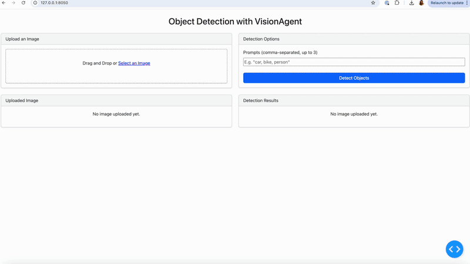

# VisionAgent Object Detection Web App

This project is an interactive web application for object detection in images, built using [VisionAgent](https://landing.ai/visionagent) and [Plotly Dash](https://dash.plotly.com/). Simply upload any image, specify the objects you want to detect, and view the detected objects with bounding boxes as well as a summary table of all the detections.



## Features

- Upload images through drag-and-drop or file selection
- Detect up to 3 different object types in a single image
- Real-time visualisation of detected objects with bounding boxes
- Colour-coded detection results based on object type and confidence score
- Detailed results table showing detection scores and bounding box coordinates
- Download results as a ZIP file containing:
  - Annotated image with bounding boxes
  - CSV file with detection details

## Prerequisites

- Python 3.7
- VisionAgent API key
  - To get a VisionAgent API key, go to VisionAgent's website and register for an account (This is really fast and you can use your Google account). Then access your API key in https://va.landing.ai/account/api-key.

## Installation

1. Clone this repository:
```bash
git clone https://github.com/cristinafernandes/agentvision_app
cd visionagent_app
```

2. Install the required dependencies:
```bash
pip install -r requirements.txt
```

3. Create a `.env` file in the project root and add your VisionAgent API key:
```
VISIONAGENT_API_KEY=your_api_key_here
```

## Usage

1. Start the application:
```bash
python app.py
```

2. Open your web browser and navigate to `http://127.0.0.1:8050`

3. Using the application:
   - Upload an image using the drag-and-drop area or file selector
   - Enter up to 3 comma-separated prompts for objects you want to detect
   - Click "Detect Objects" to process the image
   - View the results in the right panel
   - Download the results using the "Download Results" button

## Technical Details

The application is built using:
- Dash and Dash Bootstrap Components for the web interface
- VisionAgent's Agentic Object Detection API for object detection
- Pillow for image processing and drawing bounding boxes
- Python-dotenv for environment variable management
